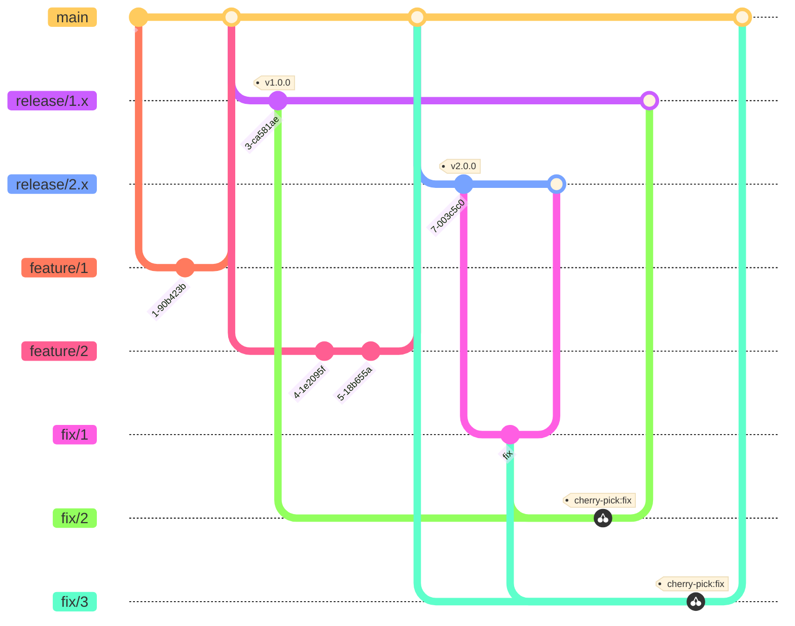

# ブランチ戦略

## 1. 概要

- GitHub Flow ベースのリリースブランチを使用して、サポートされているバージョンに修正を組み込む

### 1.1 ブランチの概要

### 1.2 ブランチの種類

| Branch Type | Role | Lifecycle | Naming Rule |
| ----------- | ---- | --------- | ------------ |
| **メインブランチ** | | | |
| main        | 次のメジャーバージョンアップのためのブランチ。  Git Flow の develop ブランチに似ている。 | 常に存在 | `main` |
| release     | 各メジャーバージョンのメンテナンスブランチ | メジャーバージョンアップ時に作成 | `release-{major_version}.x.x` |
| feature     | 機能実装ブランチ | 基本的に main ブランチから派生し、main にマージされる。  バック互換性のある変更の場合は、リリースブランチから派生し、リリース（マイナーバージョンアップ）にマージできる。 | `feature/{feature_name}` |
| fix         | バグ修正ブランチ | バグがある最新バージョンのリリースまたは main ブランチから派生し、リリースまたは main ブランチにマージされる。  他のバージョンにチェリーピックしてマージする。 | `fix/{summary}` |
| **あまり使用されないブランチ** | | | |
| renovate    | renovate によって生成されたブランチ | renovate によって自動生成される | `renovate/{branch_name}` |
| chore         | ツールの実装や設定の変更などのその他のブランチ | feature ブランチと同じ | `chore/{summary}` |
| refactor         | リファクタリングブランチ | feature ブランチと同じ。  必要に応じてリリースブランチでチェリーピックする。 | `refactor/{summary}` |
| docs         | ドキュメント更新および作成ブランチ | feature ブランチと同じ | `docs/{summary}` |
| **その他** | | | |
| backport         | サポートされている下位バージョンに反映するブランチ | サポートされている下位バージョンに反映する内容がある場合に作成される。 | `backport/{version}/{summary}` |
