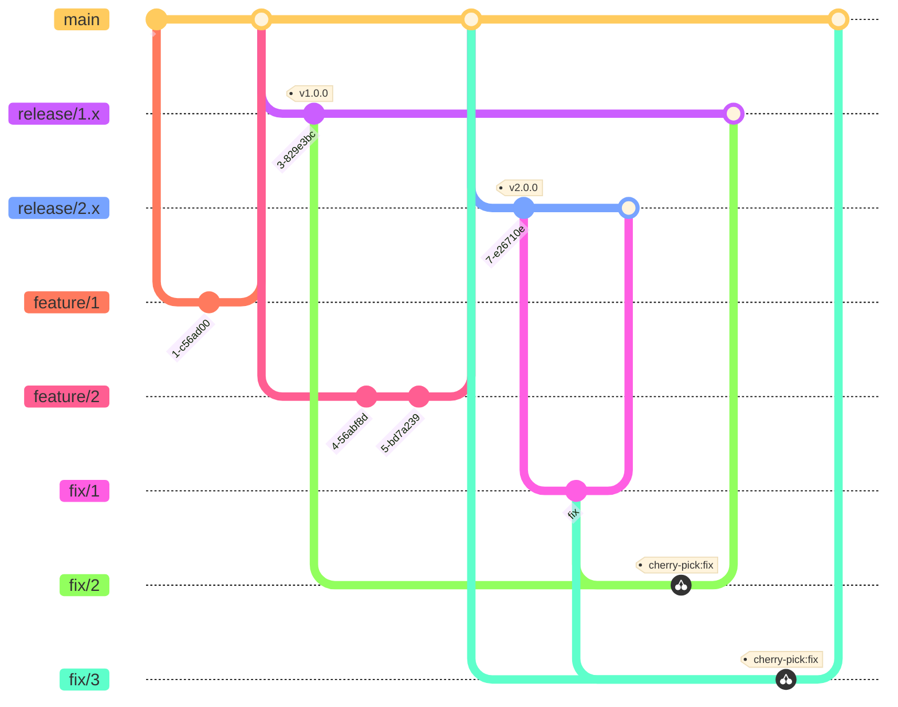

# Branch Strategy

## 1. Overview

- Use release branches based on GitHub Flow to incorporate fixes into supported versions

### 1.1 Rough Sketch

### 1.2 Branch Types

| Branch Type | Role | Lifecycle | Naming Rule |
| ----------- | ---- | --------- | ------------ |
| **Main Branches** | | | |
| main        | Branch for next major version upgrade.   Like the develop branch in Git Flow. | Always present | `main` |
| release     | Maintenance branch for each major version | Created at the time of major version upgrades | `release-{major_version}.x.x` |
| feature     | Functional Implementation Branch | Basically a temporary branch derived from the main branch and merged into main   For backward-compatible changes, you can derive from the release branch and merge into release (minor version-up) | `feature/{feature_name}` |
| fix         | Bug Fix Branch | A temporary branch derived from and merged into the release or main branch of the latest version that has the bug.   Cherry-picking and merging into other versions in support | `fix/{summary}` |
| **Less Frequently Used Branches** | | | |
| renovate    | Branches generated by renovate | automatically generated by renovate | `renovate/{branch_name}` |
| chore         | Miscellaneous branches such as tool implementation and configuration changes | Same as feature branch | `chore/{summary}` |
| refactor         | refactoring branch | Same as feature branch.   Cherry-pick on release branch if needed | `refactor/{summary}` |
| docs         | Document Update and Creation Branches | Same as feature branch | `docs/{summary}` |
| **Others** | | | |
| backport         | Branch to reflect lower versions in support | Created when there is content that should be reflected in lower versions in support. | `backport/{version}/{summary}` |
